# Larel ZK-Shielded Private AMM Swap (Soroswap Integration)

This document provides a comprehensive overview of the **Larel Private AMM Swap** feature, which bridges Larel's zero-knowledge shielded pool with the public liquidity pool of [Soroswap.Finance](https://soroswap.finance/) on Soroban.

---

## 1. Overview & Architecture

Historically, Larel/Larel functioned as a standalone *dark pool* (private order book). While this provides absolute privacy, it limits trading execution to matched private counter-orders. 

The **Larel ZK-Shielded Private AMM Swap** introduces an atomic bridging contract (`LarelSwapRouter`) that lets users trade their private shielded assets instantly using Soroswap’s public liquidity pools, and receive the swapped output assets directly back into their private shielded balances.

### Architectural Workflow

```mermaid
sequenceDiagram
    autonumber
    actor User as User Wallet (Public)
    participant SDK as Larel SDK (Client)
    participant Router as LarelSwapRouter (Contract)
    participant Pool as LarelPool (ZK Contract)
    participant AMM as SoroswapRouter (DEX Contract)

    User->>SDK: Initiate Market Swap (amount_in, amount_out_min)
    Note over SDK: Generates ZK Withdraw Proof<br/>for input note. Derives new private<br/>note commitment for output.
    SDK->>User: Request transaction signature
    User->>Router: Call swap_shielded(proof, public_inputs, path, recipient_commitment, ...)
    
    rect rgb(20, 20, 30)
        Note right of Router: Atomic Execution
        Router->>Pool: Call withdraw(proof, public_inputs, recipient = Router)
        Pool-->>Router: Releases token_in to Router
        Router->>AMM: Approve & call swap_exact_tokens_for_tokens(amount_in, amount_out_min, path, recipient = Router)
        AMM-->>Router: Transfers amount_out_actual of token_out
        Router->>Pool: Call deposit(amount = amount_out_min, commitment = recipient_commitment)
        Note over Router: Safe-guards Positive Slippage Surplus:<br/>surplus = amount_out_actual - amount_out_min
        Router->>User: Transfer surplus (token_out) to User's public address
    end
    
    Router-->>User: Transaction Confirmed
    Note over SDK: Scans new commitment &<br/>adds output note to private balance.
```



---

## 2. Smart Contract: `LarelSwapRouter`

The smart contract source is located in [contracts/larel-swap-router/src/lib.rs](file:///Users/em/web/laxstell/Larel/contracts/larel-swap-router/src/lib.rs).

### The Atomic Design & Positive Slippage Mitigation
A critical constraint of zero-knowledge shielded pools is that **note commitments must be computed offline** before the transaction is submitted. 

Because AMM prices fluctuate dynamically, the exact output amount ($amount\_out\_actual$) cannot be determined beforehand. To solve this:
1. The user computes their ZK note commitment using their target minimum output ($amount\_out\_min$).
2. The `LarelSwapRouter` executes the trade on Soroswap.
3. The router deposits exactly $amount\_out\_min$ back into the ZK pool under the user's pre-computed commitment.
4. Any excess surplus resulting from positive slippage ($amount\_out\_actual - amount\_out\_min$) is safely transferred directly to the user's public Stellar wallet address.

### Contract Interface

```rust
pub fn swap_shielded(
    env: Env,
    pool: Address,
    soroswap_router: Address,
    proof: Bytes,
    public_inputs: Bytes,
    amount_in: i128,
    token_in: Address,
    token_out: Address,
    amount_out_min: i128,
    path: Vec<Address>,
    deadline: u64,
    recipient_commitment: Val,
    user_public_address: Address,
) -> i128;
```

---

## 3. TypeScript SDK Integration

The SDK implementation is wrapped in `@larel/sdk` and exposed via the core `Larel` orchestrator.

### `sdk.swapShielded` Method Signature

```typescript
async swapShielded(params: {
  assetIn: string;          // Token symbol (e.g. 'XLM')
  assetOut: string;         // Token symbol (e.g. 'USDC')
  amountIn: string;         // String decimal amount
  amountOutMin: string;     // String decimal minimum output
  path: string[];           // Array of SAC addresses defining the hop path
  deadline?: string;        // Optional unix timestamp deadline
}): Promise<TxResult>;
```

### SDK Implementation Workflow Under the Hood:
1. **Note Selection**: Picks an unspent shielded note of `assetIn` that covers `amountIn`.
2. **Witness Generation**: Rebuilds the Merkle witness path from the indexer's local tree cache.
3. **ZK Proof Proving**: Spawns Noir’s `withdraw` circuit prover in-browser to generate the zero-knowledge proof.
4. **Note Creation**: Generates a new random shielded note of `assetOut` with `amountOutMin` and records it locally.
5. **Operation Building**: Assembles a Soroban transaction invoking `swap_shielded` on the `LarelSwapRouter` contract.
6. **Submission**: Signs the transaction via the user's connected wallet (Freighter/MetaMask) and submits it to the Stellar network.

---

## 4. Frontend UI Walkthrough

The React interface is implemented in [Swap.tsx](file:///Users/em/web/laxstell/Larel/frontend/src/components/Swap.tsx).

### Trade Mode Selection
At the top of the swap card, users can choose between two trading options:
* **Instant (AMM)**: Executes trades instantly against the public Soroswap liquidity pool.
* **Limit (Dark Pool)**: Enters a private, ZK-sealed order into the Larel matcher queue.

### Live Market Quote Integration
When **Instant (AMM)** is selected:
* The **Price** input field is disabled and set to the live market exchange rate retrieved from the Soroswap oracle query.
* The **Est. proceeds** is automatically calculated.
* Clicking **Swap** initiates the ZK-proving process, indicating: `Executing Shielded AMM Swap`.

---

## 5. Deployed Contract Addresses (Stellar Testnet)

These contracts are deployed on the Stellar testnet and mapped inside the project's [deployments.json](file:///Users/em/web/laxstell/Larel/deployments.json).

| **LarelPool** | `CB4GMI7NW73JU576KUT5GABRJ7PQ2KDF75Q7GI6T5TOIS4LX55BFTYUP` |
| **LarelSwapRouter** | `CAS23FGNBQNMCTWDO7VHNYHVJXTHFOLTN75GYELQF3BZLJJ5UW6K37VR` |
| **SoroswapRouter (Public)** | `CAG5LRYQ5JVEUI5TEID72EYOVX44TTUJT5BQR2J6J77FH65PCCFAJDDH` |
| **Native SAC (XLM)** | `CDLZFC3SYJYDZT7K67VZ75HPJVIEUVNIXF47ZG2FB2RMQQVU2HHGCYSC` |

---

## 6. Mathematical Examples & Slippage Calculations

To execute a private AMM swap, the user must define a minimum acceptable output ($\Delta y_{min}$) to construct their new shielded note commitment offline.

### Concrete Scenario: Swapping 100 XLM for USDC

1. **Initial Pool State**: 
   * XLM Reserves ($x$) = $10,000$ XLM
   * USDC Reserves ($y$) = $4,000$ USDC
   * Effective Market Price = $0.40$ USDC per XLM

2. **Deduct LP Trading Fee (0.3%)**:
   $$\Delta x_{net} = 100 \text{ XLM} \times 0.997 = 99.7 \text{ XLM}$$

3. **Calculate Expected AMM Output ($\Delta y$)**:
   $$\Delta y = \frac{y \times \Delta x_{net}}{x + \Delta x_{net}} = \frac{4000 \times 99.7}{10000 + 99.7} \approx 39.486 \text{ USDC}$$

4. **Apply Slippage Buffer (1%)**:
   The client-side wallet configures a 1% slippage tolerance to allow safe execution during block time.
   $$\Delta y_{min} = 39.486 \times 0.99 \approx 39.091 \text{ USDC}$$

5. **Offline ZK Note Generation**:
   * The client hashes and constructs a new private note commitment containing exactly **39.091 USDC** ($amount\_out\_min$).
   
6. **Execution & Refund Logic**:
   * The contract executes the swap and receives the actual **39.486 USDC** output.
   * Exactly **39.091 USDC** is deposited privately under the user's pre-computed commitment.
   * **Positive Slippage Surplus Refund**: The excess difference is refunded publicly:
     $$\text{Surplus} = 39.486 - 39.091 = 0.395 \text{ USDC}$$

---

## 7. Grand Final Pitch Presentation Q&A (Judge Prep)

### Q1: Why do we need the intermediate `LarelSwapRouter` contract? Why not call the pool and Soroswap directly from the client?
> **Answer:** 
> "To guarantee atomicity and prevent theft. If we did this in separate transactions from the client (e.g. withdraw to public, swap on AMM, deposit back), a transaction could fail midway. For example, a user could successfully withdraw their private tokens to their public address, but the subsequent swap on the public AMM could fail. The user's privacy would be exposed, and their assets left stranded in public space. The `LarelSwapRouter` contract wraps the entire sequence in a single, atomic Soroban transaction—if any step fails, the entire transaction rolls back, keeping the user's private notes intact."

### Q2: If the trade is executed on a public AMM (Soroswap), doesn't that compromise the user's transaction privacy?
> **Answer:**
> "No, the transaction privacy remains intact. To the public observer looking at the blockchain, they only see the `LarelSwapRouter` contract interacting with Soroswap. The source of the funds (the input ZK note) and the final destination (the output ZK note commitment) are shielded by our ZK-proof system. The observer cannot link the swap to any specific user wallet address or historical portfolio balance. We successfully hide the identity of the trader while leveraging public liquidity."

### Q3: Why does the router refund the positive slippage surplus to the user's public address? Why not deposit the entire actual output back into the ZK pool?
> **Answer:**
> "Because of ZK commitment determinism. A private ZK note commitment is generated offline by hashing the note's parameters (asset, amount, blinding factor, owner key). If the contract tried to deposit the actual AMM output ($amount\_out\_actual$), it would not match the pre-computed offline ZK commitment (which was calculated based on $amount\_out\_min$). The user would lose the ability to spend that note because they wouldn't have the matching preimage. By depositing exactly $amount\_out\_min$ and refunding the difference as a public surplus, we maintain perfect ZK mathematical consistency while ensuring the user still gets every cent of their market execution savings."